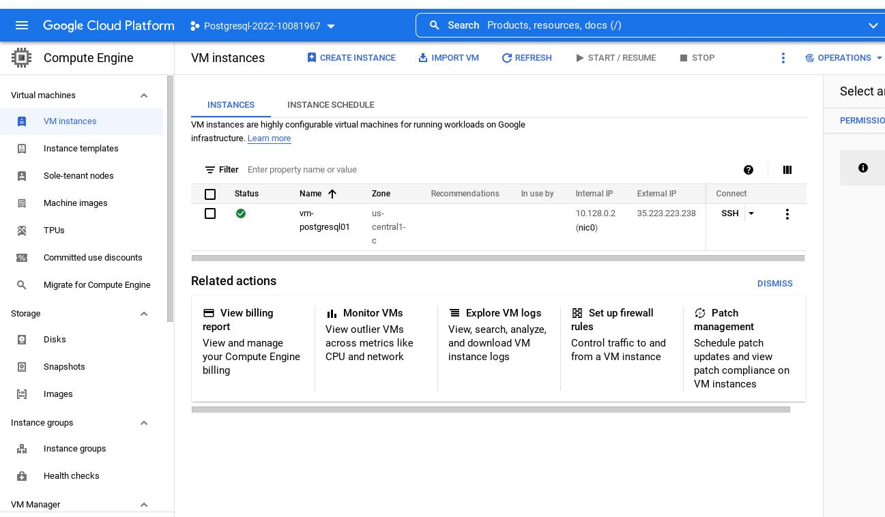

## Работа с уровнями изоляции транзакции в PostgreSQL

## Цель:

научиться работать с Google Cloud Platform на уровне Google Compute Engine (IaaS)

научиться управлять уровнем изолции транзации в PostgreSQL и понимать особенность работы уровней read commited и repeatable read

### Создание VM на Google Cloud в проекте Project name = Postgresql-2022-10081967

### Подключение к VM созданной  на Google Cloud по ssh

    asarafanov-adm@pc-asarafanov-01:~/.ssh$ ssh asarafanov-adm@35.223.223.238

### Проверяем куда мы подключились.

    asarafanov-adm@vm-postgresql01:~$ ip addr
    1: lo: <LOOPBACK,UP,LOWER_UP> mtu 65536 qdisc noqueue state UNKNOWN group default qlen 1000
        link/loopback 00:00:00:00:00:00 brd 00:00:00:00:00:00
        inet 127.0.0.1/8 scope host lo
        valid_lft forever preferred_lft forever
        inet6 ::1/128 scope host 
        valid_lft forever preferred_lft forever
    2: ens4: <BROADCAST,MULTICAST,UP,LOWER_UP> mtu 1460 qdisc mq state UP group default qlen 1000
        link/ether 42:01:0a:80:00:02 brd ff:ff:ff:ff:ff:ff
        inet 10.128.0.2/32 scope global dynamic ens4
        valid_lft 3434sec preferred_lft 3434sec
        inet6 fe80::4001:aff:fe80:2/64 scope link 
        valid_lft forever preferred_lft forever

### Установка и настройка postgresql14.

    root@vm-postgresql01:~# sh -c 'echo "deb http://apt.postgresql.org/pub/repos/apt $(lsb_release -cs)-pgdg main" > /etc/apt/sources.list.d/pgdg.list'
    root@vm-postgresql01:~# wget --quiet -O - https://www.postgresql.org/media/keys/ACCC4CF8.asc | sudo apt-key add -
    OK
    root@vm-postgresql01:~# apt-get update
    root@vm-postgresql01:~# apt install postgresql-14

### Проверяем установлен ли postgresql

    root@vm-postgresql01:~# pg_lsclusters 
    Ver Cluster Port Status Owner    Data directory              Log file
    14  main    5432 online postgres /var/lib/postgresql/14/main /var/log/postgresql/postgresql-14-main.log

    root@vm-postgresql01:~# systemctl status postgresql@14-main.service 
    ● postgresql@14-main.service - PostgreSQL Cluster 14-main
         Loaded: loaded (/lib/systemd/system/postgresql@.service; enabled-runtime; vendor preset: enabled)
         Active: active (running) since Sat 2022-03-05 13:24:27 UTC; 2min 7s ago
       Main PID: 3720 (postgres)
          Tasks: 7 (limit: 4696)
         Memory: 17.2M
         CGroup: /system.slice/system-postgresql.slice/postgresql@14-main.service
                 ├─3720 /usr/lib/postgresql/14/bin/postgres -D /var/lib/postgresql/14/main -c config_file=/etc/postgresql/14/main/postgresql.conf
                 ├─3722 postgres: 14/main: checkpointer
                 ├─3723 postgres: 14/main: background writer
                 ├─3724 postgres: 14/main: walwriter
                 ├─3725 postgres: 14/main: autovacuum launcher
                 ├─3726 postgres: 14/main: stats collector
                 └─3727 postgres: 14/main: logical replication launcher

    Mar 05 13:24:25 vm-postgresql01 systemd[1]: Starting PostgreSQL Cluster 14-main...
    Mar 05 13:24:27 vm-postgresql01 systemd[1]: Started PostgreSQL Cluster 14-main.

    root@vm-postgresql01:~# su - postgres
    postgres@vm-postgresql01:~$ psql
    psql (14.2 (Ubuntu 14.2-1.pgdg20.04+1))
    Type "help" for help.

    postgres=# \echo :AUTOCOMMIT
    on
#### Первая сессия:
    postgres=# \set AUTOCOMMIT OFF
    postgres=# \echo :AUTOCOMMIT 
    OFF

#### Вторая сессия:
    postgres=# \echo :AUTOCOMMIT
    on
    postgres=# \set AUTOCOMMIT OFF
    postgres=# \echo :AUTOCOMMIT
    OFF

#### Первая сессия:
    postgres=# create table persons(id serial,first_name text,second_name text);
    CREATE TABLE
    postgres=*# insert into persons(first_name,second_name) values ('ivan','ivanov');
    INSERT 0 1
    postgres=*# insert into persons(first_name,second_name) values ('sergey','sergeev');
    INSERT 0 1
    postgres=*# commit;

### 1. Проверка работы уровня изоляции READ COMMITTED

#### 1.1. Первая сессия:
    test_db=# show transaction isolation level;
    transaction_isolation 
    -----------------------
    read committed
    (1 row)

#### 1.2. Вторая сессия:
    postgres=# show transaction isolation level;
    transaction_isolation 
    -----------------------
    read committed
    (1 row)

#### 1.3. Первая сессия:
    test_db=*# insert into persons(first_name,second_name) values ('petr','petrov');
    INSERT 0 1

#### 1.4. Вторая сессия:
    test_db=*# select * from persons;
    id | first_name | second_name 
    ----+------------+-------------
    1 | ivan       | ivanov
    2 | sergey     | sergeev
    (2 rows)
  
Добавленной третей записи в первой сессии не видно.

#### 1.5. Первая сессия:
    test_db=*# commit;
    COMMIT

#### 1.6. Вторая сессия:
    test_db=*# select * from persons;
    id | first_name | second_name 
    ----+------------+-------------
    1 | ivan       | ivanov
    2 | sergey     | sergeev
    3 | petr       | petrov
    (3 rows)

Запись во второй сессии видна после выполнения commit в первой сессии.

#### В уровне изоляции READ COMMITTED
1. Выполняется создание снимка при старте каждой команды транзакции
2. Каждая команда транзакции "видит" изменения, зафикисированные на момент старта команды    

Что подтверждается выше выполненными командами.

### 2. Проверка работы уровня изоляции REPEATABLE READ

#### 2.1. Первая сессия:

    test_db=# set transaction isolation level repeatable read;
    SET
    test_db=*# show transaction isolation level;
    transaction_isolation 
    -----------------------
    repeatable read
    (1 row)

#### 2.2. Вторая сессия:

    test_db=# set transaction isolation level repeatable read;
    SET
    test_db=*# show transaction isolation level;
    transaction_isolation 
    -----------------------
    repeatable read
    (1 row)

#### 2.3. Первая сессия:
    test_db=*# insert into persons(first_name,second_name) values ('sveta','svetova');
    INSERT 0 1

#### 2.4. Вторая сессия:
    test_db=*# select * from persons;
    id | first_name | second_name 
    ----+------------+-------------
    1 | ivan       | ivanov
    2 | sergey     | sergeev
    3 | petr       | petrov
    (3 rows)

Добавленной записи в первой сессии не отображается.

#### 2.5. Первая сессия:
    test_db=*# commit;
    COMMIT

#### 2.6. Вторая сессия:
    test_db=*# select * from persons;
     id | first_name | second_name 
    ----+------------+-------------
      1 | ivan       | ivanov
      2 | sergey     | sergeev
      3 | petr       | petrov
    (3 rows)

Добавленной и зафиксированной записи в первой сессии не видно.

Завершаем транзакцию во второй сесии: COMMIT

Выполняем SELECT

    test_db=# select * from persons;
     id | first_name | second_name 
    ----+------------+-------------
      1 | ivan       | ivanov
      2 | sergey     | sergeev
      3 | petr       | petrov
      4 | sveta      | svetova
    (4 rows)

Сохранения четвертая запись появилась в запросе.

#### В уровне изоляции REPEATABLE READ
1. Создание снимка при старте первой команды транзакции
2. Все команды транзакции "видят" измененияЮ зафиксированные на момент старта первой команды транизакции

Что подтверждается выше выполненными командами.

