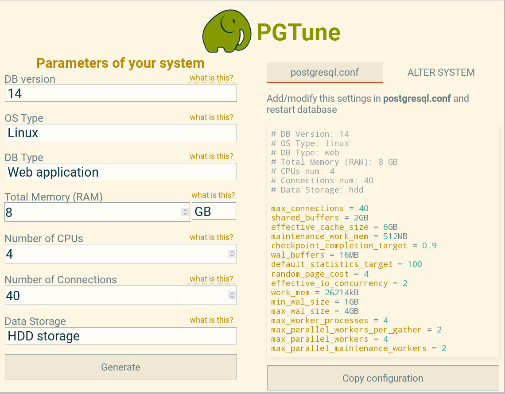
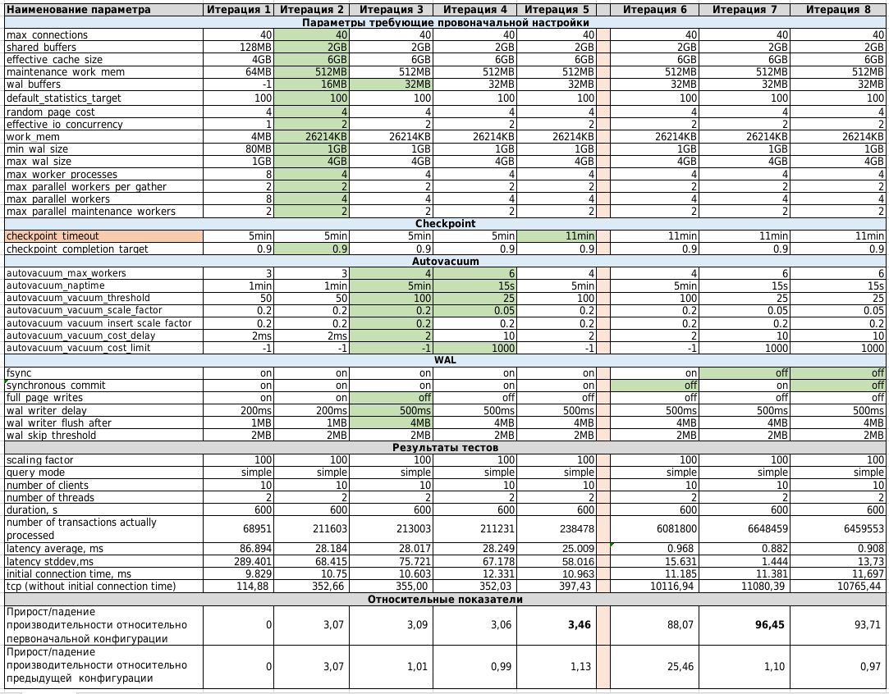

### Нагрузочное тестирование и тюнинг PostgreSQL

Цель:

Cделать нагрузочное тестирование PostgreSQL

Настроить параметры PostgreSQL для достижения максимальной производительности

### Выполнение ДЗ

#### Развернуть виртуальную машину,поставить на неё PostgreSQL 14
Параметры ВМ:

    ОС - Ubuntu 20.04
    CPU - 4 ядра
    RAM - 8GB
    Disk - НDD, 20 GB, Шина (драйвер) - VirtIO

Витруальная машина развернута на гипервизоре KVM.

#### Настроика кластер PostgreSQL 14 на максимальную производительность
( не обращаем внимание на возможные проблемы с надежностью в случае аварийной перезагрузки виртуальной машины)

Нагрузка кластера будет выполняться в несколько итераций с помощью утилиты pgbench.

На каждой итерации будут вноситься измения в конфигурационные параметры и выполняться попытка оценки из влиятния на производительнось.

##### Для проверения тестов необходимо создать и наполнить БД.

##### Создаем БД для тестов с названием benchmark

        postgres@ubuntu-20:~$ psql
        psql (14.2 (Ubuntu 14.2-1.pgdg20.04+1+b1))
        Type "help" for help.

        postgres=# create database benchmark;
        CREATE DATABASE
        postgres=# \q

##### Заполняем базу данных benchmark данными с помощью утилиты pgbench

        postgres@ubuntu-20:~$ pgbench -i benchmark -s 100
        dropping old tables...
        NOTICE:  table "pgbench_accounts" does not exist, skipping
        NOTICE:  table "pgbench_branches" does not exist, skipping
        NOTICE:  table "pgbench_history" does not exist, skipping
        NOTICE:  table "pgbench_tellers" does not exist, skipping
        creating tables...
        generating data (client-side)...
        10000000 of 10000000 tuples (100%) done (elapsed 63.35 s, remaining 0.00 s)
        vacuuming...
        creating primary keys...
        done in 91.80 s (drop tables 0.00 s, create tables 0.26 s, client-side generate 63.61 s, vacuum 14.16 s, primary keys 13.77 s).
        postgres@ubuntu-20:~$ 

        postgres=# select datname, pg_size_pretty(pg_database_size(datname)) from pg_database;
        datname  | pg_size_pretty 
        -----------+----------------
        postgres  | 8553 kB
        benchmark | 1504 MB
        template1 | 8553 kB
        template0 | 8401 kB
        (4 rows)

Размер БД  benchmark ~ 1.5GB
##### Описание теста

    pgbench -c10 -P 60 -j 2 -T 600 benchmark 
    
        где:
            C - количество подключений
            P - период времени в сек когда выводить данные
            j - кол-во потоков 
            T - общий период времени проведения теста

Все будет проведено 8 Итераций.

Итерация 1 - конфигурационные параметры по умолчанию - после развертывания инстанса Postgresql

Итерация 2 - изменены значения конфигурационных параметров в соответствии с расчетов pgtune (см ниже)

Итерация 3 - вносим изменения в параметры обеспечивающие работу WAL и autovacuum. Пытаемся уменьшить использование операций I/O 

Итерация 4 - вносим изменения в параметры avtovacuum для обеспечения более агрессивной работы

Итерация 5 - увеличиваем промежуток между выполнением контрольных точек до 11 минут. Тем самым исключаем данную операцию из теста, тем самым убираем нагрузку на I/O

Итерации 6 - 8 не регомендуется проводить на промышленных установках Postgressql. 

Итерация 6 - отключение synchronous_commit 

Итерация 7 - отключение fsync

Итерация 8 - отключение synchronous_commit и fsync одновременно

