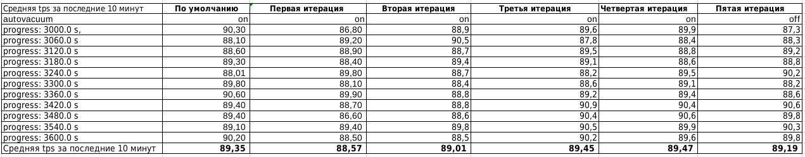

### Настройка autovacuum с учетом оптимальной производительности

Цель:

запустить нагрузочный тест pgbench с профилем нагрузки DWH

настроить параметры autovacuum для достижения максимального уровня устойчивой производительности

### Выполнение ДЗ

#### Стенд для настройки autovacuum.

Собран на базе ВМ поднятой на гипервизоре KVM. В качестве ОС используется Ubuntu 20.04

Параметры ВМ:

        Total Memory (RAM): 4 GB
        CPUs num: 1
        Data Storage: hdd
        Size hdd - 20GB
    
На ВМ поднят postgresql 14.

Установлены следующие параметры кластера Postgresql:

        max_connections = 40
        shared_buffers = 1GB
        effective_cache_size = 3GB
        maintenance_work_mem = 512MB
        checkpoint_completion_target = 0.9
        wal_buffers = 16MB
        default_statistics_target = 500
        random_page_cost = 4
        effective_io_concurrency = 2
        work_mem = 6553kB
        min_wal_size = 4GB
        max_wal_size = 16GB

Перед проведением тестотов выполняем команду:
     pgbench -i postgres

#### Проведение теста и настройка autovacuum.

1. Запускаем pgbench -c8 -P 60 -T 3600 -U postgres postgres
2. Собираем статистику работы стенда
3. Меняем параметры влияющие на работу autovacuum 
4. Запускаем повторно pgbench -c8 -P 60 -T 3600 -U postgres postgres
5. Собираем статистику и выбираем требуемые значения параметров.

#### Изменять планируется следующие параметры влияющие на работу autovacuum:

        autovacuum
        autovacuum_max_workers
        autovacuum_naptime
        autovacuum_vacuum_threshold
        autovacuum_vacuum_scale_factor
        autovacuum_vacuum_insert_scale_factor
        autovacuum_vacuum_cost_delay
        autovacuum_vacuum_cost_limit

#### Результаты тестов

Наилучшим с точки зрения общего количества транзакций и tps оказалась третья итерация. При этом в данной итерации не была выбрана агрессивная политика работы autovacuum. 

Основные параметры с помощью которых были получен наилучший результат:

autovacuum_naptime (integer) - Задаёт минимальную задержку между двумя запусками автоочистки для отдельной базы данных. 

autovacuum_vacuum_threshold (integer) - Задаёт минимальное число изменённых или удалённых кортежей, при котором будет выполняться VACUUM для отдельно взятой таблицы. 

Это объеснется тем что ВМ была с одним ядром и postgresql не смог задействовать в процессе autovacuum несколько процессов, а использование агрессной политики avtovacuum (первая итерация) приводила к частому переключению ресурсов и замедлению работы.

#### Наилучший тест с наибольшим количеством транзакций и tps

                postgres@ubuntu-20:/etc/postgresql/14/main$ pgbench -c8 -P 60 -T 3600 -U postgres postgres
                pgbench (14.2 (Ubuntu 14.2-1.pgdg20.04+1))
                starting vacuum...end.
                progress: 60.0 s, 90.2 tps, lat 88.555 ms stddev 29.965
                progress: 120.0 s, 90.6 tps, lat 88.357 ms stddev 26.831
                progress: 180.0 s, 91.5 tps, lat 87.418 ms stddev 27.762
                progress: 240.0 s, 90.2 tps, lat 88.730 ms stddev 29.799
                progress: 300.0 s, 88.9 tps, lat 90.008 ms stddev 37.037
                progress: 360.0 s, 88.7 tps, lat 90.145 ms stddev 30.939
                progress: 420.0 s, 89.1 tps, lat 89.828 ms stddev 27.016
                progress: 480.0 s, 89.1 tps, lat 89.715 ms stddev 29.522
                progress: 540.0 s, 88.9 tps, lat 89.970 ms stddev 28.707
                progress: 600.0 s, 89.6 tps, lat 89.341 ms stddev 30.672
                progress: 660.0 s, 91.0 tps, lat 87.945 ms stddev 25.096
                progress: 720.0 s, 90.5 tps, lat 88.374 ms stddev 26.207
                progress: 780.0 s, 90.3 tps, lat 88.578 ms stddev 27.072
                progress: 840.0 s, 90.7 tps, lat 88.185 ms stddev 25.710
                progress: 900.0 s, 90.9 tps, lat 88.017 ms stddev 28.302
                progress: 960.0 s, 88.4 tps, lat 90.497 ms stddev 29.102
                progress: 1020.0 s, 88.8 tps, lat 90.128 ms stddev 26.280
                progress: 1080.0 s, 87.9 tps, lat 90.986 ms stddev 29.845
                progress: 1140.0 s, 89.6 tps, lat 89.183 ms stddev 30.138
                progress: 1200.0 s, 89.5 tps, lat 89.474 ms stddev 29.589
                progress: 1260.0 s, 89.0 tps, lat 89.847 ms stddev 27.075
                progress: 1320.0 s, 88.4 tps, lat 90.459 ms stddev 31.313
                progress: 1380.0 s, 88.1 tps, lat 90.877 ms stddev 33.189
                progress: 1440.0 s, 88.7 tps, lat 90.204 ms stddev 30.152
                progress: 1500.0 s, 88.9 tps, lat 90.051 ms stddev 32.811
                progress: 1560.0 s, 89.8 tps, lat 89.101 ms stddev 27.545
                progress: 1620.0 s, 90.4 tps, lat 88.528 ms stddev 25.409
                progress: 1680.0 s, 90.3 tps, lat 88.626 ms stddev 26.003
                progress: 1740.0 s, 90.1 tps, lat 88.746 ms stddev 24.550
                progress: 1800.0 s, 90.1 tps, lat 88.673 ms stddev 26.623
                progress: 1860.0 s, 89.0 tps, lat 89.901 ms stddev 27.493
                progress: 1920.0 s, 89.5 tps, lat 89.451 ms stddev 24.343
                progress: 1980.0 s, 88.9 tps, lat 90.012 ms stddev 29.657
                progress: 2040.0 s, 88.3 tps, lat 90.421 ms stddev 35.755
                progress: 2100.0 s, 88.2 tps, lat 90.770 ms stddev 30.574
                progress: 2160.0 s, 88.2 tps, lat 90.707 ms stddev 28.761
                progress: 2220.0 s, 88.9 tps, lat 89.951 ms stddev 29.470
                progress: 2280.0 s, 89.2 tps, lat 89.708 ms stddev 30.111
                progress: 2340.0 s, 89.2 tps, lat 89.709 ms stddev 28.543
                progress: 2400.0 s, 89.0 tps, lat 89.826 ms stddev 31.136
                progress: 2460.0 s, 89.8 tps, lat 89.188 ms stddev 25.121
                progress: 2520.0 s, 90.5 tps, lat 88.382 ms stddev 24.911
                progress: 2580.0 s, 89.1 tps, lat 89.738 ms stddev 29.342
                progress: 2640.0 s, 88.8 tps, lat 90.088 ms stddev 34.644
                progress: 2700.0 s, 88.7 tps, lat 90.147 ms stddev 31.420
                progress: 2760.0 s, 89.9 tps, lat 88.971 ms stddev 28.733
                progress: 2820.0 s, 90.6 tps, lat 88.290 ms stddev 24.752
                progress: 2880.0 s, 89.2 tps, lat 89.707 ms stddev 26.612
                progress: 2940.0 s, 89.0 tps, lat 89.838 ms stddev 29.920
                progress: 3000.0 s, 89.6 tps, lat 89.291 ms stddev 29.904
                progress: 3060.0 s, 87.8 tps, lat 91.142 ms stddev 29.307
                progress: 3120.0 s, 89.5 tps, lat 89.369 ms stddev 27.962
                progress: 3180.0 s, 89.1 tps, lat 89.635 ms stddev 29.636
                progress: 3240.0 s, 88.2 tps, lat 90.790 ms stddev 37.936
                progress: 3300.0 s, 88.6 tps, lat 90.334 ms stddev 30.236
                progress: 3360.0 s, 89.2 tps, lat 89.699 ms stddev 26.576
                progress: 3420.0 s, 90.9 tps, lat 87.985 ms stddev 25.493
                progress: 3480.0 s, 90.4 tps, lat 88.408 ms stddev 28.057
                progress: 3540.0 s, 90.5 tps, lat 88.319 ms stddev 26.959
                progress: 3600.0 s, 90.2 tps, lat 88.707 ms stddev 26.604
                transaction type: <builtin: TPC-B (sort of)>
                scaling factor: 1
                query mode: simple
                number of clients: 8
                number of threads: 1
                duration: 3600 s
                number of transactions actually processed: 321969
                latency average = 89.442 ms
                latency stddev = 28.979 ms
                initial connection time = 16.026 ms
                tps = 89.434643 (without initial connection time)
                postgres@ubuntu-20:/etc/postgresql/14/main$ 

