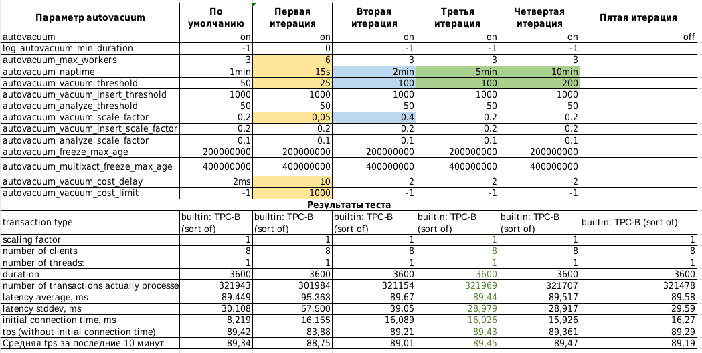

### Настройка autovacuum с учетом оптимальной производительности

Цель:

запустить нагрузочный тест pgbench с профилем нагрузки DWH

настроить параметры autovacuum для достижения максимального уровня устойчивой производительности

### Выполнение ДЗ

#### Стенд для настройки autovacuum.

Собран на базе ВМ поднятой на гипервизоре KVM. В качестве ОС используется Ubuntu 20.04

Параметры ВМ:

        Total Memory (RAM): 4 GB
        CPUs num: 1
        Data Storage: hdd
        Size hdd - 20GB
    
На ВМ поднят postgresql 14.

Установлены следующие параметры кластера Postgresql:

        max_connections = 40
        shared_buffers = 1GB
        effective_cache_size = 3GB
        maintenance_work_mem = 512MB
        checkpoint_completion_target = 0.9
        wal_buffers = 16MB
        default_statistics_target = 500
        random_page_cost = 4
        effective_io_concurrency = 2
        work_mem = 6553kB
        min_wal_size = 4GB
        max_wal_size = 16GB

Перед проведением тестотов выполняем команду:
     pgbench -i postgres

#### Проведение теста и настройка autovacuum.

1. Запускаем pgbench -c8 -P 60 -T 3600 -U postgres postgres
2. Собираем статистику работы стенда
3. Меняем параметры влияющие на работу autovacuum 
4. Запускаем повторно pgbench -c8 -P 60 -T 3600 -U postgres postgres
5. Собираем статистику и выбираем требуемые значения параметров.

#### Изменять планируется следующие параметры влияющие на работу autovacuum:

        autovacuum
        autovacuum_max_workers
        autovacuum_naptime
        autovacuum_vacuum_threshold
        autovacuum_vacuum_scale_factor
        autovacuum_vacuum_insert_scale_factor
        autovacuum_vacuum_cost_delay
        autovacuum_vacuum_cost_limit

#### Результаты тестов

